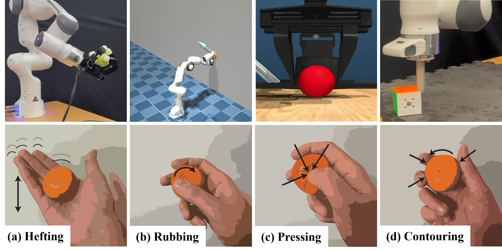

# contact_aware_active_learning

<h1 align="center">
    Behavior Synthesis via Contact-Aware Fisher Information Maximization
</h1>

Code for <a href="">Behavior Synthesis via Contact-Aware Fisher Information Maximization</a>. Hrishikesh Sathyanarayan and Ian Abraham. In Robotics Science and Systems (RSS), 2025.

<!-- 

    

 -->

    Contact dynamics hold immense amounts of information that can improve a robot's ability to characterize and learn about objects in their environment through interactions.
    However, collecting information-rich contact data is challenging due to its inherent sparsity and non-smooth nature, requiring an active approach to maximize the utility of contacts for learning.
    In this work, we investigate an optimal experimental design approach to synthesize robot behaviors that produce contact-rich data for learning. 
    We observe emergent robot behaviors that are able to excite contact interactions that efficiently learns object parameters across a range of parameter learning examples. 
    Last, we demonstrate the utility of contact-awareness for learning parameters through contact-seeking behaviors on several robotic experiments.

